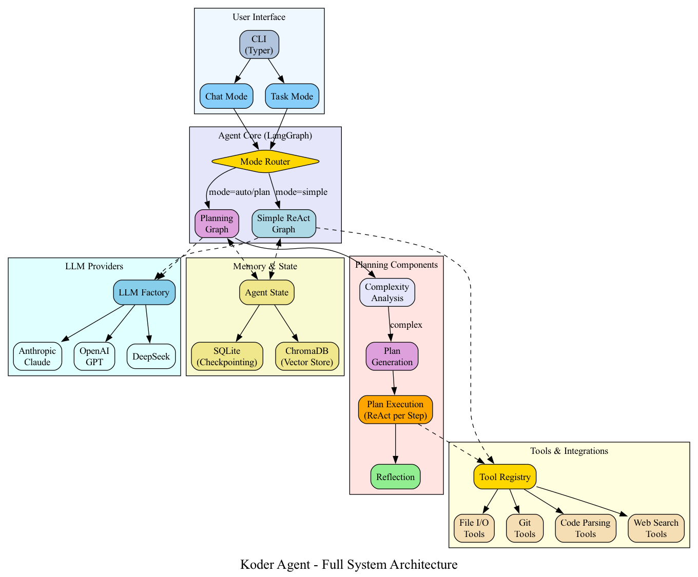

# Koder

> AI-powered code assistant using LangGraph and LangChain

[](https://www.python.org/downloads/)
[](https://github.com/langchain-ai/langgraph)
[](LICENSE)
[](docs/getting-started.md)

🤖 **AI code assistant that thinks before it acts** - ReAct pattern with intelligent planning for complex tasks and instant execution for simple ones.

## Quick Install

```bash
# Install uv (if not already installed)
curl -LsSf https://astral.sh/uv/install.sh | sh

# Clone and setup
git clone <your-repo-url> koder
cd koder
uv sync

# Configure (copy .env.example to .env and add your API keys)
cp .env.example .env
# Edit .env with your preferred LLM provider key
```

## 30-Second Examples

### Chat Mode
```bash
# Start interactive chat
uv run koder chat start

# Quick questions get instant answers
You: Show me main.py
[File contents displayed immediately]

# Complex tasks trigger planning mode
You: Add user authentication to the API
📋 Plan Mode: Multi-file implementation task
✅ Tasks [🔄 Creating user model, ⏳ Adding endpoints...]
```

### One-Off Tasks
```bash
# Code analysis
uv run koder task run "Analyze the project structure"

# Git operations
uv run koder task run "What are the recent commits?"

# File operations
uv run koder task run "Read README.md and summarize it"
```

### Provider Switching
```bash
# Use any LLM provider at runtime
uv run koder chat start --provider anthropic  # Claude
uv run koder chat start --provider openai     # GPT
uv run koder chat start --provider deepseek   # DeepSeek
```

<details>
<summary>📊 Architecture & Deep Dive</summary>

## Architecture Overview



Koder uses a ReAct (Reasoning-Action) pattern with intelligent complexity analysis:

- **Simple tasks** → Direct execution (file reads, git status, etc.)
- **Complex tasks** → Planning mode with step-by-step breakdown
- **Multi-provider support** → Switch between Claude, OpenAI, DeepSeek instantly
- **State persistence** → Resume conversations with SQLite checkpointing

### Key Features

| Feature | Description |
|---------|-------------|
| 🤖 **Agentic AI** | ReAct pattern with reasoning and action loops |
| 🔄 **Multi-Provider** | Anthropic Claude, OpenAI GPT, DeepSeek support |
| 💬 **Interactive Chat** | Conversational interface with history |
| ⚡ **Smart Planning** | Auto-detects task complexity |
| 🧰 **Extensible Tools** | Code parsing, git, filesystem, MCP |
| 🔍 **Semantic Search** | Vector-based code search with ChromaDB |
| 📊 **Observability** | LangSmith tracing and structured logging |

### Technology Stack

| Component | Technology | Version |
|-----------|-----------|---------|
| Runtime | Python | 3.11+ |
| Orchestration | LangGraph | 0.2.0+ |
| LLM Framework | LangChain | 0.3.0+ |
| CLI Framework | Typer | 0.12+ |
| Terminal UI | Rich | 13.7+ |
| Vector DB | ChromaDB | 0.5+ |

</details>

<details>
<summary>📚 Documentation</summary>

- **[Getting Started](docs/getting-started.md)** - Detailed setup and configuration guide
- **[Architecture](docs/architecture.md)** - System design and components
- **[Configuration](docs/configuration.md)** - Environment variables and options
- **[Planning](docs/planning.md)** - How intelligent planning works
- **[MCP Integration](docs/mcp.md)** - Model Context Protocol support

</details>

<details>
<summary>🛠️ Development</summary>

```bash
# Install dev dependencies
uv sync --extra dev

# Run tests
uv run pytest

# Code quality
uv run ruff check .
uv run ruff format .
uv run mypy koder/
```

**Project Structure**
```
koder/
├── koder/              # Main package
│   ├── agent/          # LangGraph agent
│   ├── cli/            # CLI commands
│   ├── llm/            # LLM providers
│   ├── tools/          # Agent tools
│   └── config/         # Configuration
├── tests/              # Test suite
└── docs/               # Documentation
```

</details>

## License

MIT License - see [LICENSE](LICENSE) file for details

---

**Built with** ❤️ using [LangGraph](https://github.com/langchain-ai/langgraph) and inspired by [Anthropic Claude Code](https://claude.com/claude-code)