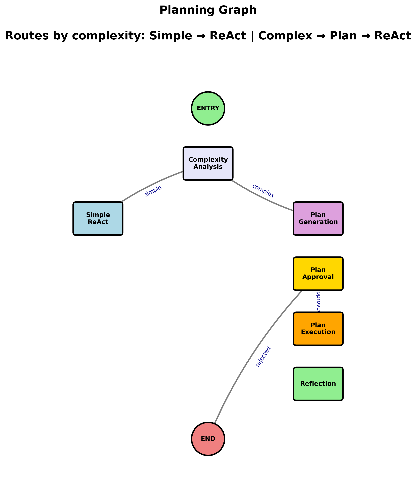
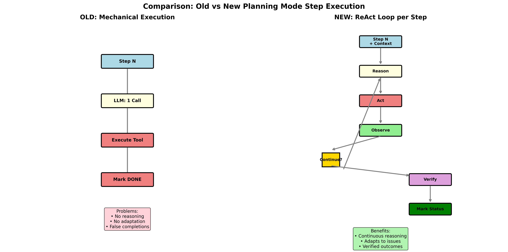

# Koder

> The AI assistant that plans multi-file changes like a senior developer

[](https://github.com/bene/koder/stargazers)
[](https://www.python.org/downloads/)
[](LICENSE)

🚀 **Turns "Add user authentication" into a step-by-step implementation plan** - Automatically detects complex refactoring, breaks it into manageable steps, and executes across multiple files. Instant answers for simple questions, intelligent planning for complex ones.

## Quick Start

```bash
# Install and setup in one command
curl -sSL https://koder.dev/install | bash

# Start coding
koder chat
```

<details>
<summary>🔧 Alternative installation methods</summary>

### Using pip
```bash
pip install koder-cli
koder chat
```

### Using uv (recommended for development)
```bash
uv add koder-cli
koder chat
```

### From source
```bash
git clone https://github.com/bene/koder.git
cd koder
uv sync
uv run koder chat
```

</details>

## See It In Action

### Simple Questions → Instant Answers
```bash
$ koder chat
You: What's in main.py?
[File contents displayed immediately]
```

### Complex Tasks → Intelligent Planning



```bash
$ koder task run "Add user authentication to the API"

📋 Plan Mode: Multi-file implementation detected

✅ Step 1: Create user model (src/models/user.py)
✅ Step 2: Implement auth endpoints (src/api/auth.py)
✅ Step 3: Add JWT middleware (src/middleware/auth.py)

[3 files created, 1 modified in 2.3 seconds]
```

**Unlike autocomplete tools (Copilot, Cursor) that suggest single lines, Koder plans and executes complex multi-file changes automatically.**

<details>
<summary>📊 What makes Koder different</summary>

| Feature | Autocomplete Tools | Koder |
|---------|-------------------|-------|
| **Multi-file changes** | ❌ Manual work | ✅ Automatic planning |
| **Context awareness** | ⚠️ Limited file scope | ✅ Whole codebase understanding |
| **LLM flexibility** | 🔒 Provider-specific | ✅ Switch Claude/OpenAI/DeepSeek instantly |
| **Complex task handling** | ❌ Line-by-line only | ✅ Step-by-step implementation |



</details>

<details>
<summary>🔧 Advanced Features</summary>

### Multiple LLM Providers
```bash
koder chat --provider anthropic  # Claude
koder chat --provider openai     # GPT-4
koder chat --provider deepseek   # DeepSeek
```

### Custom Workspace
```bash
koder chat --workspace /path/to/your/project
```

### One-Off Tasks
```bash
koder task run "Analyze the codebase structure"
koder task run "What changed in the last commit?"
koder task run "Refactor this function to be more efficient"
```

</details>

<details>
<summary>📚 Documentation</summary>

- **[Getting Started](docs/getting-started.md)** - Complete setup guide
- **[Architecture](docs/architecture.md)** - How Koder works
- **[Configuration](docs/configuration.md)** - All available options

</details>

## Built With ❤️

Powered by [LangGraph](https://github.com/langchain-ai/langgraph) and inspired by [Anthropic Claude Code](https://claude.com/claude-code)

---

**MIT License** - see [LICENSE](LICENSE) file for details