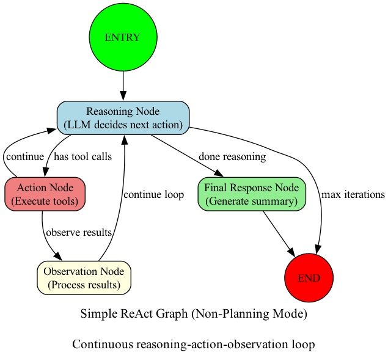

# Agent Architecture Visualization Guide

This guide explains how to generate visual diagrams of the Koder agent architecture.

## Available Visualization Scripts

We provide two visualization scripts, depending on your preferences and installed libraries:

### 1. **Graphviz Version** (Recommended - Better Quality)

**File:** `visualize_agent_graph.py`

**Requirements:**
```bash
pip install graphviz
# Also requires graphviz system package:
# macOS: brew install graphviz
# Ubuntu: sudo apt-get install graphviz
# Windows: Download from https://graphviz.org/download/
```

**Usage:**
```bash
python visualize_agent_graph.py
```

**Generates:**
- `docs/diagrams/simple_react_graph.png` - Basic ReAct loop
- `docs/diagrams/planning_graph.png` - Planning graph with complexity routing
- `docs/diagrams/step_execution_detail.png` - Detailed ReAct loop in step execution
- `docs/diagrams/comparison.png` - Old vs new planning mode comparison
- `docs/diagrams/full_architecture.png` - Complete system architecture

### 2. **Matplotlib Version** (No External Dependencies)

**File:** `visualize_agent_graph_matplotlib.py`

**Requirements:**
```bash
pip install networkx matplotlib
```

**Usage:**
```bash
python visualize_agent_graph_matplotlib.py
```

**Generates:**
- `docs/diagrams/simple_react_matplotlib.png`
- `docs/diagrams/planning_matplotlib.png`
- `docs/diagrams/step_execution_matplotlib.png`
- `docs/diagrams/comparison_matplotlib.png`

## What Each Diagram Shows

### 1. Simple ReAct Graph

Shows the basic reasoning-action-observation loop used in non-planning mode:

```
ENTRY → Reasoning → Action → Observation → (loop back to Reasoning)
                  ↓
            Final Response → END
```

**Key Points:**
- Continuous loop of reasoning and action
- LLM can iterate multiple times
- Works well for simple tasks

### 2. Planning Graph

Shows how the agent routes tasks based on complexity:

```
ENTRY → Complexity Analysis
           ├─ Simple Task → ReAct Loop → END
           └─ Complex Task → Plan Generation → Approval → Execution → Reflection → END
```

**Key Points:**
- Automatic complexity detection
- Simple tasks use direct ReAct loop
- Complex tasks use planning with structured execution

### 3. Step Execution Detail

Shows the **NEW** ReAct loop architecture within each plan step:

```
Load Context → LLM Reasoning → Has Tools?
                                ├─ YES → Execute → Observe → (loop back)
                                └─ NO → Verify Completion → Update Status
```

**Key Points:**
- Each step now has full ReAct capability
- Preserves full message history
- Verifies objective completion
- Can iterate up to 5 times per step

### 4. Comparison Diagram

Side-by-side comparison of old vs new planning mode:

**OLD (Mechanical):**
- Step → 1 LLM Call → Execute Tool → Mark DONE
- Problems: No reasoning, no adaptation, false completions

**NEW (ReAct Loop):**
- Step → Reason → Act → Observe → (loop) → Verify → Mark Status
- Benefits: Continuous reasoning, adapts to issues, verified outcomes

### 5. Full Architecture (Graphviz only)

Complete system showing all components:
- User Interface Layer (CLI, Chat, Task)
- Agent Core (Graph Router, ReAct, Planning)
- Planning Components (Analysis, Generation, Execution, Reflection)
- Tools Layer (File I/O, Git, Code Parsing, Web Search)
- LLM Providers (Anthropic, OpenAI, DeepSeek)
- Memory & State (Agent State, ChromaDB, SQLite)

## Architecture Overview

### Simple ReAct Mode (Non-Planning)

Best for:
- Single file operations
- Quick queries
- Simple analysis tasks

Flow:
1. User request → Reasoning node
2. LLM decides action → Action node executes tools
3. Results → Observation node processes
4. Loop continues until task complete
5. Final response generated

### Planning Mode (Complex Tasks)

Best for:
- Multi-file operations
- Feature implementations
- Refactoring across files
- Complex analysis

Flow:
1. User request → Complexity analysis
2. If complex:
   - Generate structured plan
   - User approves plan
   - Execute each step with **ReAct loop**
   - Verify each step completion
   - Reflect on overall outcomes

### Key Innovation: ReAct Loop in Step Execution

**Before (Broken):**
```python
for step in plan:
    llm.invoke_once()  # Single call
    execute_tool()
    mark_complete()    # Always complete!
```

**After (Fixed):**
```python
for step in plan:
    messages = full_history  # Preserve context
    while not_done and iterations < 5:
        response = llm.invoke(messages)
        if has_tools:
            results = execute_tools()
            messages.append(results)  # Observation
        else:
            break  # LLM is done
    verify_completion()  # Actually check!
    update_status()
```

## Customizing Visualizations

Both scripts are well-commented and easy to customize. You can:

1. **Change colors**: Edit the `color` values in node definitions
2. **Adjust layout**: Modify the `pos` dictionary coordinates
3. **Add new diagrams**: Create new functions following the existing patterns
4. **Change output format**:
   - Graphviz: Change `format='png'` to `'svg'`, `'pdf'`, etc.
   - Matplotlib: Change `plt.savefig()` format parameter

## Troubleshooting

### Graphviz "command not found"

Install the system package:
```bash
# macOS
brew install graphviz

# Ubuntu/Debian
sudo apt-get install graphviz

# Windows
# Download from https://graphviz.org/download/
```

### Import errors

Install required Python packages:
```bash
# For graphviz version
pip install graphviz

# For matplotlib version
pip install networkx matplotlib
```

### Output directory doesn't exist

The scripts automatically create `docs/diagrams/` directory. If you get permission errors, create it manually:
```bash
mkdir -p docs/diagrams
```

## Examples

### Generate all diagrams (Graphviz):
```bash
cd /path/to/koder
python visualize_agent_graph.py
```

### Generate all diagrams (Matplotlib):
```bash
cd /path/to/koder
python visualize_agent_graph_matplotlib.py
```

### View generated diagrams:
```bash
open docs/diagrams/*.png
# or
ls -lh docs/diagrams/
```

## Integration with Documentation

These diagrams can be embedded in documentation:

```markdown
## Architecture



The agent uses a continuous reasoning-action-observation loop...
```

## Contributing

To add new visualizations:

1. Create a new function in the script following the pattern:
   ```python
   def create_my_diagram():
       # Create graph
       # Define nodes and edges
       # Return graph, positions, etc.
   ```

2. Add it to the `main()` function:
   ```python
   diagrams['my_diagram'] = (create_my_diagram(), "My Diagram Description")
   ```

3. Run the script to generate

## Additional Resources

- [Graphviz Documentation](https://graphviz.org/documentation/)
- [NetworkX Documentation](https://networkx.org/documentation/)
- [Matplotlib Documentation](https://matplotlib.org/stable/index.html)
- [LangGraph Documentation](https://langchain-ai.github.io/langgraph/)
